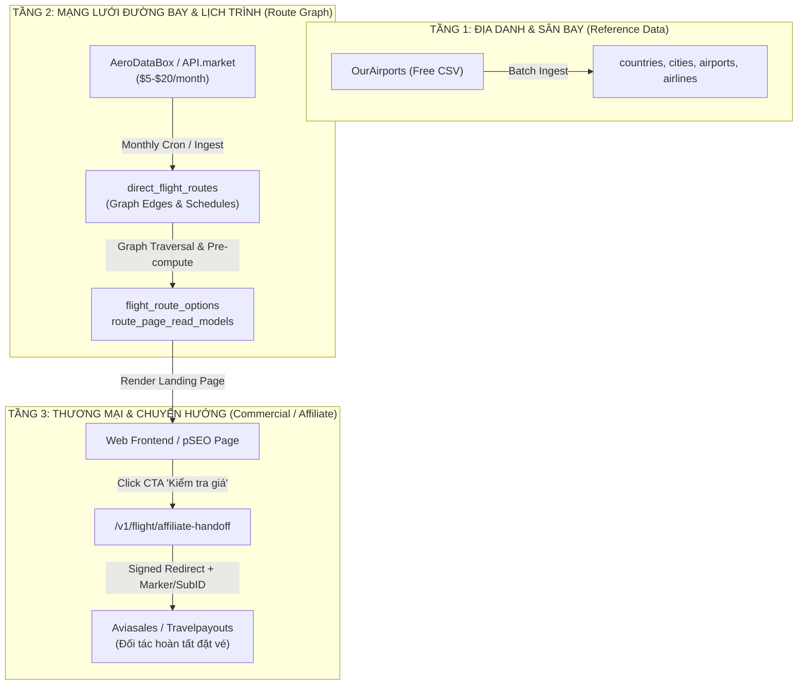
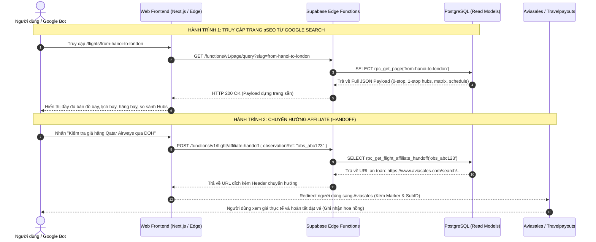

# ✈️ Tripways Flight Routing Engine — Kiến trúc Toàn diện & Hướng dẫn cho Developer

Tài liệu này cung cấp toàn bộ bức tranh kiến trúc, luồng dữ liệu (Data Flow), hành trình người dùng (User Journey), mô hình cơ sở dữ liệu và các hàm/RPCs của tính năng **Flight Routing & Route Explorer** trong hệ thống Tripways.

---

## 📑 Mục lục

1. [Bức tranh Tổng quan & Triết lý Sản phẩm](#1-bức-tranh-tổng-quan--triết-lý-sản-phẩm)
2. [Kiến trúc Dữ liệu 3 Tầng (3-Tier Hybrid Architecture)](#2-kiến-trúc-dữ-liệu-3-tầng-3-tier-hybrid-architecture)
3. [Mô hình Cơ sở Dữ liệu & Thiết kế Lưu trữ (Database Schema)](#3-mô-hình-cơ-sở-dữ-liệu--thiết-kế-lưu-trữ-database-schema)
4. [Hành trình Người dùng & Phễu Chuyển đổi (User Journeys)](#4-hành-trình-người-dùng--phễu-chuyển-đổi-user-journeys)
5. [Chi tiết Các Luồng & Function / RPCs (Flows & Functions)](#5-chi-tiết-các-luồng--function--rpcs-flows--functions)
6. [Thuật toán Tìm Tuyến & Đồ thị Nối chuyến (Graph Routing Engine)](#6-thuật-toán-tìm-tuyến--đồ-thị-nối-chuyến-graph-routing-engine)
7. [Sổ tay Phát triển & Vận hành cho Dev mới (Developer Guide)](#7-sổ-tay-phát-triển--vận-hành-cho-dev-mới-developer-guide)

---

## 1. Bức tranh Tổng quan & Triết lý Sản phẩm

### 🎯 Mục tiêu Cốt lõi

Tripways **KHÔNG PHẢI** là một đại lý bán vé trực tuyến (OTA) tìm vé thời gian thực (như Skyscanner, Kiwi hay Google Flights).
Tripways là một **Flight Route Explorer & Programmatic SEO (pSEO) Platform** (tương tự như _FlightConnections.com_ hoặc _FlightsFrom.com_), kết hợp tầng chuyển hướng thương mại **Affiliate Handoff** sang đối tác bán vé (Aviasales / Travelpayouts).

### 💡 Vấn đề mà Tripways giải quyết

Người dùng và các công cụ tìm kiếm cần câu trả lời nhanh chóng và trực quan cho các câu hỏi:

1. _Từ Hà Nội (HAN) bay đến London (LHR) có những cách nào?_
2. _Hãng nào đang khai thác chặng này? Bay thẳng mất bao lâu? Bay vào những thứ mấy trong tuần?_
3. _Nếu không có chuyến bay thẳng, có thể nối chuyến qua những Hub trung chuyển nào thuận tiện nhất (Doha, Dubai, Bangkok, Singapore...)?_

### ⚡ Lợi thế Kỹ thuật

- **Zero Real-time Dependency**: Khi người dùng vào trang web hoặc Google Bot thu thập dữ liệu (crawl), hệ thống **100% đọc từ PostgreSQL Read Models cục bộ**. Không bao giờ gọi API bên thứ ba lúc render trang $\to$ Tốc độ phản hồi luôn $< 10\text{ms}$, chi phí hạ tầng cực thấp, không bị nghẽn API quota.
- **Chi phí Vận hành Siêu Thấp**: Thay vì tốn hàng ngàn USD/tháng cho các API GDS đắt đỏ, Tripways sử dụng mô hình dữ liệu Hybrid (\$5 – \$20/tháng).

---

## 2. Kiến trúc Dữ liệu 3 Tầng (3-Tier Hybrid Architecture)

Hệ thống phân tách rạch ròi 3 tầng dữ liệu độc lập:



1. **Tầng 1 — Tham chiếu Địa lý (Base Geo Reference)**:
   - **Nguồn:** _OurAirports_ (Dữ liệu mở miễn phí 100%).
   - **Nhiệm vụ:** Cung cấp thông tin Quốc gia, Thành phố, Sân bay, Tọa độ ($Lat, Long$), Múi giờ, Loại sân bay (`large_airport`, `medium_airport`).
2. **Tầng 2 — Đồ thị Tuyến bay & Lịch trình (Direct Routes & Schedule Graph)**:
   - **Nguồn:** _AeroDataBox_ (qua API.market).
   - **Nhiệm vụ:** Cung cấp danh sách các chặng bay thẳng (`origin_iata -> destination_iata`), hãng khai thác (`airline_iata`), thời gian bay trung bình, ngày bay trong tuần (`days_of_week`). Chạy Batch Ingest 1 tháng/lần và đồng bộ vào chu kỳ đổi mùa IATA (cuối tháng 3 & cuối tháng 10).
3. **Tầng 3 — Thương mại & Handoff (Monetization Layer)**:
   - **Nguồn:** _Travelpayouts Data API v3_ (cung cấp giá vé quan sát gần nhất đã cache) & _Travelpayouts Affiliate Campaign (Aviasales Campaign)_.
   - **Nhiệm vụ:** Không dùng để tìm đường bay hay metasearch thời gian thực (Aviasales Search API yêu cầu tối thiểu 50.000 MAU và được chuyển sang P5). Tầng 3 ở MVP chỉ dùng để hiển thị mức giá tham khảo quan sát gần đây (`observed_amount`) và tạo liên kết chuyển tiếp an toàn (Affiliate Handoff kèm Marker & SubID). Khi người dùng nhấn nút _"Kiểm tra giá hãng này"_, hệ thống ký URL chuyển tiếp người dùng sang Aviasales (`https://www.aviasales.com/search/...`) để hoàn tất giao dịch đặt vé.

---

## 3. Mô hình Cơ sở Dữ liệu & Thiết kế Lưu trữ (Database Schema)

Cơ sở dữ liệu được tổ chức theo kiến trúc phân tách Schema sạch sẽ trong Supabase PostgreSQL:

```
PostgreSQL Database
 ├── admin
 │    └── data_sources          --> Quản lý nguồn gốc & quyền sở hữu dữ liệu (lineage)
 └── public
      ├── countries             --> Danh mục Quốc gia (ISO2, ISO3, Tên, Châu lục)
      ├── cities                --> Danh mục Đô thị/Thành phố (Tên, Slug, Tọa độ)
      ├── airports              --> Danh mục Sân bay (IATA, ICAO, Tọa độ, Timezone)
      ├── airlines              --> Danh mục Hãng hàng không (IATA, Tên, Call sign)
      ├── direct_flight_routes  --> Đồ thị Mạng lưới Chặng bay thẳng (Graph Edges)
      ├── flight_route_options  --> Bảng Read Model tối ưu cho API Search Route
      ├── route_pages           --> Danh mục Trang pSEO Tuyến bay (Canonical Slug)
      ├── route_page_read_models--> Pre-rendered JSON DTO cho trang Tuyến bay
      ├── airport_pages         --> Danh mục & Read Model cho trang Sân bay Hub
      ├── city_pages            --> Danh mục & Read Model cho trang Thành phố
      └── flight_route_prices   --> Bảng lưu tham chiếu giá vé quan sát & Affiliate Path
```

### Chi tiết Các Bảng Trọng yếu

#### 1. `public.airports` (Nút mạng đồ thị)

- **Khóa chính:** `id` (UUID).
- **Cột cốt lõi:** `iata` (CHAR 3, ví dụ `HAN`), `icao`, `name`, `slug`, `city_id`, `country_id`, `latitude`, `longitude`, `timezone`, `airport_type`.
- **Ràng buộc:** Toàn bộ dữ liệu gắn với `source_id` trỏ về `admin.data_sources`.

#### 2. `public.direct_flight_routes` (Cạnh của đồ thị mạng lưới)

- **Nhiệm vụ:** Lưu trữ toàn bộ các đường bay thẳng kết nối giữa 2 sân bay trên thế giới.
- **Cấu trúc:**
  - `origin_airport_id` & `destination_airport_id`: Foreign key trỏ đến `public.airports`.
  - `origin_iata` & `destination_iata`: Chỉ số IATA phục vụ tra cứu nhanh.
  - `airline_id` / `airline_iata`: Hãng hàng không vận hành (ví dụ: `VN`, `QR`, `SQ`).
  - `flight_duration_minutes`: Thời gian bay dự kiến (phút).
  - `days_of_week`: Mảng số nguyên `[1,2,3,4,5,6,7]` biểu thị các ngày trong tuần có chuyến.
  - `is_active`: Trạng thái tuyến bay còn đang khai thác hay không.
- **Index:** Compound Index `(origin_iata, destination_iata)` và `(destination_iata, origin_iata)`.

#### 3. `public.flight_route_options` (Read Model cho Route Search)

- **Nhiệm vụ:** Bảng tổng hợp được tính sẵn (Materialized / Aggregated) phục vụ trực tiếp cho giao diện tìm kiếm tuyến bay (`rpc_search_routes`).
- **Cấu trúc:**
  - `origin_airport_iata`, `destination_airport_iata`.
  - `stops`: `0` (Bay thẳng), `1` (1 trạm dừng), `2` (2 trạm dừng).
  - `layover_airports`: Mảng các sân bay trung chuyển (ví dụ `["DOH"]` hoặc `["BKK", "IST"]`).
  - `operating_airlines`: Mảng các hãng khai thác toàn bộ hành trình.
  - `total_duration_minutes`: Tổng thời gian bay + thời gian nối chuyến.

#### 4. `public.route_page_read_models` (Read Model cho pSEO)

- **Nhiệm vụ:** Lưu trữ toàn bộ JSON DTO của một trang pSEO tuyến bay (ví dụ `/flights/from-han-to-lhr`).
- **Đặc tính:** Khi crawler (Google Bot) hoặc khách truy cập vào URL, server chỉ cần `SELECT payload FROM route_page_read_models WHERE page_id = ...` và trả về ngay lập tức mà không cần JOIN nhiều bảng hay tính toán đồ thị realtime.

#### 5. `public.flight_route_prices` (Tham chiếu Affiliate)

- **Nhiệm vụ:** Lưu vết giá vé quan sát gần nhất (`observed_amount`, `currency_code`, `valid_until`) và `affiliate_path`.
- **Cột nhận dạng:** `public_reference` (Mã tham chiếu ẩn danh dạng `obs_...`). Khi khách bấm vào nút Affiliate, frontend gửi mã này lên server để phân giải thành URL Aviasales an toàn.

---

## 4. Hành trình Người dùng & Phễu Chuyển đổi (User Journeys)



### Hành trình 1: Khách hàng Khám phá từ Google Search (pSEO Journey)

1. **Tìm kiếm Google**: Người dùng gõ _"flights from hanoi to london"_.
2. **Landing Page**: Người dùng click vào link của Tripways (`tripways.com/flights/from-han-to-lhr`).
3. **Hiển thị thông tin định lượng đầy đủ (Anti-Thin Content)**:
   - Bản đồ hiển thị đường bay thẳng (nếu có) và các tuyến nối chuyến.
   - Ma trận lịch bay theo các ngày trong tuần (Thứ 2, 4, 6 có Vietnam Airlines; hàng ngày có Qatar Airways qua Doha).
   - Khoảng cách bay ($km$), thời gian bay trung bình, số chuyến/tuần.
   - Bảng so sánh các phương án trung chuyển: Nối chuyến qua Doha (`DOH`) mất bao lâu vs qua Dubai (`DXB`) hay Bangkok (`BKK`).

### Hành trình 2: Khám phá Tương tác (Interactive Route Explorer UI)

1. **Autocomplete Sân bay / Thành phố**: Người dùng vào trang chủ, gõ _"Bang"_ vào ô tìm kiếm $\to$ Frontend gọi `/functions/v1/location-suggest` $\to$ Gợi ý nhanh: _Bangkok (BKK / DMK), Bangalore (BLR), Bangor (BGR)_.
2. **Khám phá Tuyến bay**: Chọn điểm đi _Bangkok_ và điểm đến _Paris_ $\to$ Frontend gọi `/functions/v1/route-search/query` $\to$ Trả về danh sách tất cả lựa chọn bay thẳng và 1-stop qua các Hubs.
3. **Bộ lọc thông minh (Filters)**: Người dùng có thể lọc theo:
   - Số điểm dừng (Chỉ bay thẳng, tối đa 1 điểm dừng).
   - Hãng hàng không yêu thích (Emirates, Qatar Airways, Singapore Airlines, v.v.).
   - Sân bay nối chuyến cụ thể (Chỉ muốn quá cảnh tại Singapore `SIN`).

### Hành trình 3: Chuyển hướng Thương mại (Affiliate Handoff)

1. Bên cạnh mỗi phương án đường bay và mỗi hãng hàng không, hiển thị nút CTA: _"Kiểm tra giá vé"_ (Contextual In-line CTA).
2. Khi người dùng click, server tạo liên kết affiliate chuyển tiếp an toàn (`/v1/flight/affiliate-handoff`) có gắn mã đối tác `marker` và `sub_id`.
3. Người dùng được chuyển hướng sang Aviasales để kiểm tra giá vé thời gian thực và tiến hành thanh toán. Tripways nhận hoa hồng trên mỗi giao dịch thành công.

---

## 5. Chi tiết Các Luồng & Function / RPCs (Flows & Functions)

### 🔹 1. Lấy dữ liệu Trang pSEO: `public.rpc_get_page`

- **Mục đích:** Cung cấp toàn bộ dữ liệu để render trang Landing Page (SSR/SSG/ISR).
- **Đầu vào:** `p_slug` (TEXT, ví dụ: `'from-han-to-lhr'`, `'singapore-sin'`, `'bangkok'`).
- **Cơ chế hoạt động:**
  1. Kiểm tra loại trang: `route`, `airport`, hay `city`.
  2. Truy vấn trực tiếp từ bảng read model tương ứng (`route_page_read_models`, `airport_page_read_models`, `city_page_read_models`).
  3. Trả về JSON envelope chuẩn: `{ "data": { ... }, "error": null }`.

### 🔹 2. Tìm kiếm Tuyến bay Tương tác: `public.rpc_search_routes`

- **Mục đích:** Phục vụ công cụ tìm kiếm và lọc tuyến bay động trên giao diện người dùng.
- **Đầu vào:**
  - `p_scope`: JSON xác định phạm vi tìm kiếm (`origin_city`, `origin_airport`, `city_pair`, v.v.).
  - `p_filters`: Bộ lọc (số điểm dừng, hãng hàng không, sân bay quá cảnh, khoảng giá tham khảo).
  - `p_page_size` & `p_after`: Phân trang theo Cursor (Keyset Pagination).
- **Cơ chế hoạt động:** Quét bảng `flight_route_options`, áp dụng các điều kiện lọc và trả về danh sách các lựa chọn hành trình tối ưu.

### 🔹 3. Gợi ý Địa điểm Tìm kiếm: `public.rpc_suggest_locations`

- **Mục đích:** Phục vụ thanh tìm kiếm Autocomplete siêu nhanh.
- **Đầu vào:** `p_query` (TEXT, ví dụ: `'han'`), `p_limit` (INTEGER).
- **Cơ chế hoạt động:** Tìm kiếm kết hợp theo mã IATA, ICAO và tên Thành phố / Sân bay, sắp xếp ưu tiên theo quy mô sân bay (`large_airport` > `medium_airport`).

### 🔹 4. Phân giải Chuyển hướng Affiliate: `public.rpc_get_flight_affiliate_handoff`

- **Mục đích:** Xử lý click chuyển hướng thương mại an toàn, ẩn danh hóa URL đích và kiểm tra thời hạn.
- **Đầu vào:** `p_observation_ref` (Mã tham chiếu dạng `obs_...`).
- **Cơ chế hoạt động:**
  1. Tìm bản ghi tương ứng trong `flight_route_prices` với điều kiện `status = 'published'` và `valid_until > now()`.
  2. Ghép URL đích được allowlist (`https://www.aviasales.com` + `affiliate_path`).
  3. Trả về link an toàn kèm thông điệp minh bạch liên kết tiếp thị (Affiliate Disclosure).

---

## 6. Thuật toán Tìm Tuyến & Đồ thị Nối chuyến (Graph Routing Engine)

Hệ thống biểu diễn mạng lưới hàng không toàn cầu dưới dạng một **Đồ thị Hướng có Trọng số (Directed Weighted Graph)**:

- **Đỉnh (Vertices / Nodes)**: Các Sân bay thương mại (`airports`).
- **Cạnh (Edges)**: Các chặng bay thẳng (`direct_flight_routes`). Trọng số cạnh là Thời gian bay (`flight_duration_minutes`) và Khoảng cách ($km$).

### 1. Bay thẳng (0-Stop Direct Flight)

Truy vấn trực tiếp các cạnh $A \to B$ trong bảng `direct_flight_routes`:

```sql
SELECT airline_iata, flight_duration_minutes, days_of_week
FROM public.direct_flight_routes
WHERE origin_iata = 'HAN' AND destination_iata = 'SIN' AND is_active = TRUE;
```

### 2. Nối chuyến qua 1 Trạm dừng (1-Stop Connection via Hubs)

Để tối ưu hóa hiệu năng và tránh bùng nổ tổ hợp (Combinatorial Explosion), hệ thống giới hạn việc tìm kiếm 1 trạm dừng $A \to H \to B$ qua **Top 50 Sân bay Trung chuyển Toàn cầu (Major Global Hubs)**:

- **Các Hubs tiêu biểu:** `SIN` (Singapore), `BKK` (Bangkok), `DOH` (Doha), `DXB` (Dubai), `IST` (Istanbul), `HND` (Tokyo Haneda), `LHR` (London Heathrow), `FRA` (Frankfurt), `ICN` (Seoul Incheon), v.v.
- **Thuật toán SQL Graph Traversal:**

```sql
SELECT
    r1.origin_iata,
    r1.destination_iata AS layover_hub,
    r2.destination_iata,
    r1.airline_iata AS leg1_airline,
    r2.airline_iata AS leg2_airline,
    (r1.flight_duration_minutes + r2.flight_duration_minutes) AS flight_time_minutes
FROM public.direct_flight_routes r1
JOIN public.direct_flight_routes r2
  ON r1.destination_iata = r2.origin_iata
WHERE r1.origin_iata = 'HAN'
  AND r2.destination_iata = 'LHR'
  AND r1.destination_iata IN (SELECT iata FROM admin.top_global_hubs)
  AND r1.is_active = TRUE AND r2.is_active = TRUE;
```

### 3. Thuật toán Tính Khoảng cách Địa lý (Haversine Formula)

Hệ thống tự động tính khoảng cách cung tròn giữa 2 sân bay theo tọa độ $(Lat_1, Lon_1)$ và $(Lat_2, Lon_2)$ bằng công thức Haversine để cung cấp dữ liệu định lượng chính xác trên từng trang SEO.

---

## 7. Sổ tay Phát triển & Vận hành cho Dev mới (Developer Guide)

### 🛠️ Bộ Lệnh Hàng Ngày (Developer Cheat Sheet)

```bash
# 1. Chạy toàn bộ Unit Tests của Edge Functions
deno test --config supabase/functions/deno.json --allow-read supabase/functions

# 2. Kiểm tra định dạng code (Code Style & Formatting)
deno fmt --config supabase/functions/deno.json --check supabase/functions

# 3. Tự động format code theo chuẩn
deno fmt --config supabase/functions/deno.json supabase/functions

# 4. Tái tạo database migrations sau khi chỉnh sửa file trong supabase/sql_src/
bash scripts/regenerate-supabase-migrations.sh

# 5. Reset local database và chạy kiểm tra schema
supabase db reset --local --yes
```

### ⚠️ Những Quy tắc Bất di Bất dịch (Golden Rules)

1. **Source of Truth của Database nằm tại `supabase/sql_src/`**:
   - **KHÔNG BAO GIỜ** chỉnh sửa trực tiếp các file trong `supabase/migrations/`.
   - Luôn chỉnh sửa file tương ứng trong `supabase/sql_src/`, sau đó chạy lệnh `bash scripts/regenerate-supabase-migrations.sh` để sinh lại migration.
2. **Bảo mật Cơ sở dữ liệu (RLS & Search Path)**:
   - Tất cả các bảng trong `public` bắt buộc phải `ENABLE ROW LEVEL SECURITY`.
   - Mặc định `REVOKE ALL ON TABLE ... FROM anon, authenticated`. Chỉ cấp quyền `SELECT` qua các RPCs được kiểm soát.
   - Mọi hàm SQL `SECURITY DEFINER` bắt buộc phải có `SET search_path = ''` để chống tấn công SQL Injection và Search Path Hijacking.
3. **Quy tắc Chống Phạt Thin Content (Google Helpful Content Update)**:
   - Không bao giờ tạo trang pSEO rỗng không có dữ liệu thực tế.
   - Nếu một tuyến đường không có dữ liệu chuyến bay thẳng và không có phương án nối chuyến hợp lệ, hệ thống phải tự động đánh dấu trang là `noindex` hoặc không sinh trang.
4. **Bảo toàn Tầng Affiliate Handoff**:
   - Mọi liên kết chuyển hướng sang đối tác (Aviasales) phải luôn đi qua Edge Function `v1/flight/affiliate-handoff` và RPC `rpc_get_flight_affiliate_handoff`.
   - Không bao giờ hardcode link đối tác ở client để đảm bảo tính an toàn của đối tác và dễ dàng thay đổi cấu hình SubID/Marker khi cần.

---

_Tài liệu này được biên soạn để đảm bảo tính chuẩn xác và đồng nhất cho toàn bộ đội ngũ phát triển Tripways._
