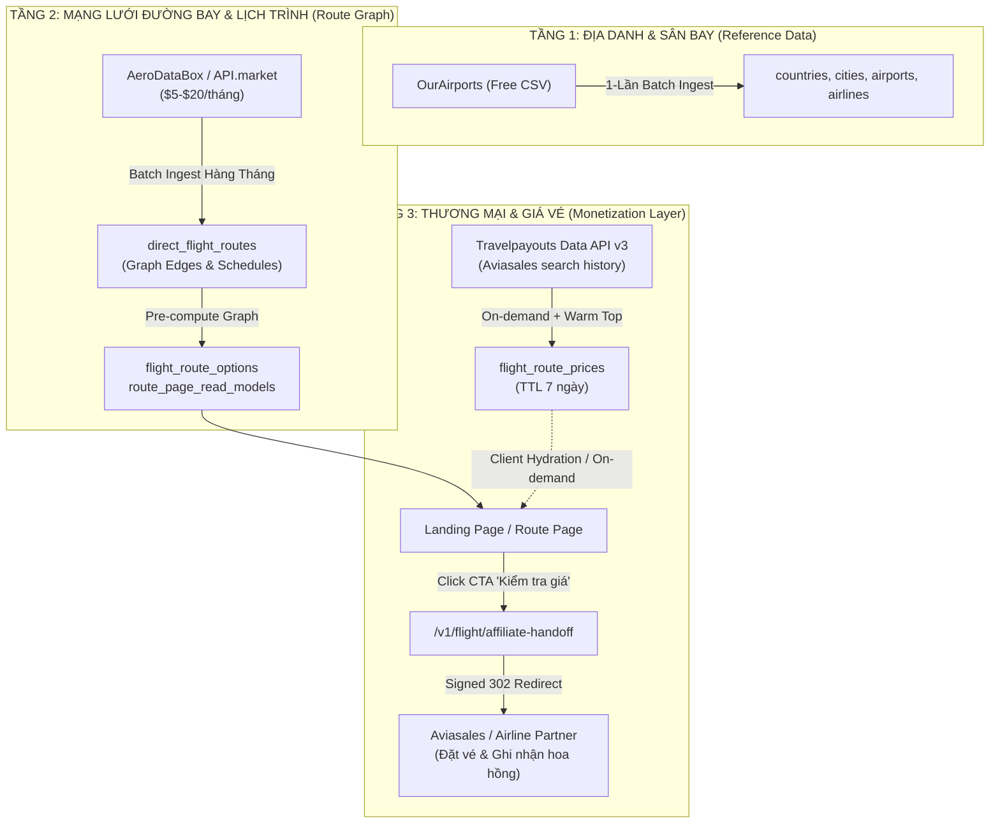
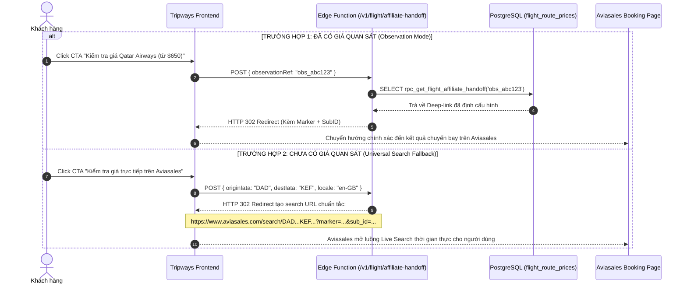

# ✈️ Kế hoạch Triển khai Luồng Dữ liệu Hàng không, Cơ chế Graceful Fallback & Tầng Thương mại (Data Pipeline & Commercial Execution Plan)

**Vị trí:** `docs/product/flight-data-pipeline-and-commercial-execution-plan.md`  
**Trạng thái:** Kế hoạch thực thi chuẩn hóa cho MVP (P1 – P3)  
**Cập nhật:** 2026-09-01  
**Chủ sở hữu:** Tripways Core Team  
**Tài liệu liên quan:** `tripways-mvp-roadmap.md`, `tripways-roadmap-phases.md`, `p2-licensed-flight-data-prd.md`, `p3-commercial-mvp-prd.md`

---

## 1. Bức tranh Tổng quan & Triết lý Dữ liệu

Tripways là nền tảng **Flight Route Explorer & Programmatic SEO (pSEO)** kết hợp tầng chuyển hướng thương mại **Affiliate Handoff**. Hệ thống giải quyết bài toán khám phá đường bay toàn cầu với chi phí hạ tầng tối thiểu ($5 – $20/tháng) và tốc độ tải trang cực nhanh (< 10ms SSR/SSG).

### 🎯 Nguyên tắc Cốt lõi
1. **Zero Realtime Dependency lúc SSR:** Không bao giờ gọi API bên thứ ba khi render trang hoặc khi Google Bot crawl.
2. **Phân tách rạch ròi 3 Tầng Dữ liệu:** Địa danh (Tầng 1) $\to$ Đồ thị Tuyến bay (Tầng 2) $\to$ Giá vé & Chuyển hướng (Tầng 3).
3. **Cấm tuyệt đối OpenFlights:** OpenFlights là dữ liệu tĩnh lịch sử, không có giá, không cập nhật định kỳ và bị cấm 100% trong toàn bộ mã nguồn, database và API.
4. **Tính trung thực dữ liệu (Data Integrity):** Không tự bịa ra khoảng giá (price range) nếu không có bằng chứng quan sát thực tế; thiếu giá thì để trống (`null`) thay vì render giá ảo.



---

## 2. Timeline & Chiến lược Nạp Dữ liệu (Ingestion Schedule)

Mỗi nhà cung cấp API có tính chất dữ liệu, chi phí và tần suất cập nhật hoàn toàn khác nhau. Chiến lược nạp dữ liệu được thiết kế tối ưu như sau:

| Tầng | Nguồn API / Dữ liệu | Loại dữ liệu | Cơ chế nạp (Ingestion Strategy) | Tần suất & Timeline | Chi phí / Quota |
| :--- | :--- | :--- | :--- | :--- | :--- |
| **Tầng 1** | **OurAirports** | Danh mục Quốc gia, Thành phố, Sân bay (IATA/ICAO, Tọa độ $Lat/Long$, Timezone, Loại sân bay) | **Offline Batch Ingest** | **1 lần khi khởi tạo hệ thống**<br/>(Cập nhật định kỳ 6 – 12 tháng/lần) | **$0** (Dữ liệu mở mã nguồn mở 100%) |
| **Tầng 2** | **AeroDataBox** *(qua API.market)* | Chặng bay thẳng (`origin -> destination`), Hãng khai thác, Giờ bay trung bình, Lịch bay theo thứ (`days_of_week`), Số hiệu chuyến bay | **Monthly Scheduled Batch Ingest** (Quét ~300–500 sân bay thương mại lớn) | **1 lần/tháng**<br/>(Tập trung vào 2 mùa đổi lịch bay IATA: cuối tháng 3 & cuối tháng 10) | **$5 – $20/tháng** (Dành 100% quota cho Direct Routes, không lãng phí vào Sân bay) |
| **Tầng 3** | **Travelpayouts Data API v3** *(Aviasales)* | Giá vé quan sát gần nhất (`observed_amount`), Tiền tệ, Ngày bay, TTL tối đa 7 ngày | **Hybrid: On-demand Cache-aside + Cache Warming** | • **Top 200–500 chặng Hot:** Cron warm 3–5 ngày/lần<br/>• **Các chặng còn lại:** Chỉ gọi khi có khách vào xem<br/>• **Smart Day 6 Cron:** Làm mới các chặng có view trong 30 ngày | **$0** (Miễn phí theo chương trình đối tác Travelpayouts) |

---

## 3. Cơ chế Graceful Fallback & Hiệu ứng Bánh đà (Flywheel Effect)

### 3.1 Thực tế về Độ phủ Giá của Aviasales Data API
Travelpayouts Data API v3 trích xuất từ **lịch sử tìm kiếm thực tế của người dùng toàn cầu trong 48h – 7 ngày qua**. Vì vậy:
* **Tuyến trục chính / Hub lớn (HAN-SGN, BKK-SIN, LHR-JFK):** Độ phủ giá đạt **90% – 98%**.
* **Tuyến thứ cấp / Khu vực (DAD-CNX, SGN-VTE):** Độ phủ giá đạt **50% – 70%**.
* **Tuyến ngách / Nối chuyến 2 trạm dừng:** Độ phủ giá **< 20% hoặc không có**.

### 3.2 Cơ chế Thích ứng Giao diện Tự nhiên (Graceful Degradation)
Hệ thống **không coi việc thiếu giá là lỗi** mà xem đây là trạng thái bình thường trong quá trình khám phá tuyến:

```text
KHI CÓ DỮ LIỆU GIÁ (Cache Hit):
┌────────────────────────────────────────────────────────┐
│ ✈️ Hanoi (HAN) ➔ London (LHR)                          │
│ ⏱️ 12h 30m Direct | Vietnam Airlines                   │
│ 💵 Giá quan sát gần nhất: từ £420                      │
│ 🏷️ [LOWEST FARE: £420 direct]                          │
│ [ Nút CTA: "Kiểm tra giá Vietnam Airlines (từ £420)" ] │
└────────────────────────────────────────────────────────┘

KHI CHƯA CÓ DỮ LIỆU GIÁ (Cache Miss / Empty Observation):
┌────────────────────────────────────────────────────────┐
│ ✈️ Da Nang (DAD) ➔ Reykjavik (KEF)                     │
│ ⏱️ 18h 15m (1 stop via DOH) | Qatar Airways            │
│ 💵 [Tự động ẩn dòng giá sàn, không render giá ảo]      │
│ 🏷️ [FASTEST OPTION: 18h 15m connecting]                │
│ [ Nút CTA: "Kiểm tra giá trực tiếp trên Aviasales" ➔ ] │
└────────────────────────────────────────────────────────┘
```

* **Trang vẫn hiển thị 100% nội dung giá trị:** Bản đồ tuyến bay, hãng khai thác, so sánh các trạm trung chuyển (Hubs), thời gian bay, cự ly bay, ma trận lịch bay, FAQ và cẩm nang di chuyển.
* **Tự động ẩn các thành phần giá:** Ẩn nhãn giá sàn (*"from $..."*), ẩn huy hiệu *"LOWEST FARE"*, chuyển trạng thái giá của card sang `unavailable`.

### 3.3 Hiệu ứng Bánh đà (Flywheel Effect)
1. Tuyến bay ngách chưa có dữ liệu giá trên hệ thống.
2. Người dùng truy cập trang Tripways và bấm nút chuyển hướng sang Aviasales để tìm vé.
3. Hành động tìm kiếm của người dùng trên Aviasales **ngay lập tức tạo ra một bản ghi giá mới trong kho dữ liệu của Aviasales**.
4. Các lượt truy cập tiếp theo trên Tripways sẽ gọi API và **lấy được mức giá mới này** về lưu vào cache 7 ngày.
$\to$ Càng nhiều người dùng sử dụng, kho dữ liệu giá của Tripways càng trở nên đầy đủ và phong phú.

---

## 4. Kiến trúc Nút bấm CTA & Affiliate Handoff

Nút CTA chuyển tiếp được thiết kế thông minh để xử lý cả hai trường hợp: **Đã có giá quan sát** và **Chưa có giá quan sát**.



### 🔒 Tiêu chuẩn Bảo mật & Affiliate Compliance:
1. **Server-Owned Allowlist:** Toàn bộ liên kết chỉ được phép chuyển hướng đến domain đối tác đã được duyệt ở server (`https://www.aviasales.com`). Chống tuyệt đối Open Redirect.
2. **Minh bạch thông tin (Affiliate Disclosure):** Mọi trang đều hiển thị thông báo rõ ràng:
   > *"Giá hiển thị là mức giá quan sát tham khảo gần đây, không phải giá bán cam kết. Giá chính xác và tình trạng chỗ sẽ được xác nhận khi hoàn tất đặt vé tại đối tác."*

---

## 5. Kế hoạch Hành động & Nghiệm thu (Actionable Checklist)

### 📌 Giai đoạn 1: Chuẩn hóa Schema & Seed Data (P1 – Hoàn tất)
- [x] Nạp dữ liệu địa lý/sân bay cơ sở từ OurAirports vào PostgreSQL (`countries`, `cities`, `airports`, `airlines`).
- [x] Loại bỏ hoàn toàn mọi tham chiếu và ràng buộc liên quan đến OpenFlights.
- [x] Viết kiểm thử bảo vệ cấu trúc SQL cấm OpenFlights (`ingestion_sql_contract.test.ts`).

### 📌 Giai đoạn 2: Đồ thị Tuyến bay & Lịch trình (P2 — AeroDataBox)
- [ ] Xây dựng Adapter `AeroDataBoxProvider` (`fetchDirectRoutesFromAeroDataBox`) nạp chặng bay thẳng theo lô.
- [ ] Thiết lập Batch Ingestion định kỳ 1 tháng/lần cho danh sách ~300 sân bay trọng điểm.
- [ ] Xây dựng hàm tính toán đồ thị tuyến bay 0–2 stops (`refresh_route_search_options`, `build_route_page_payload`).

### 📌 Giai đoạn 3: Tầng Thương mại & Giá vé Quan sát (P3 — Travelpayouts)
- [ ] Tạo bảng `public.flight_route_prices` lưu trữ giá vé với TTL tối đa 7 ngày (`valid_until`).
- [ ] Xây dựng Edge Function `/v1/flight/route-cache` xử lý On-demand Cache-aside khi người dùng mở trang.
- [ ] Triển khai script Warm Cache định kỳ cho Top 200–500 tuyến bay phổ biến nhất.
- [ ] Xây dựng Cron Job ngày thứ 6 (Smart Day 6 Refresh) chỉ làm mới các chặng có truy cập trong 30 ngày.
- [ ] Triển khai Edge Function `/v1/flight/affiliate-handoff` hỗ trợ cả 2 chế độ:
  - Phân giải `observationRef` cụ thể.
  - Phân giải Universal Search Fallback (`origin + destination`).
- [ ] Hoàn thiện giao diện Graceful Fallback trên Frontend Next.js (tự ẩn nhãn giá khi chưa có dữ liệu giá mà không vỡ giao diện).
- [ ] Thiết lập Kill Switch cho toàn bộ module giá: Tắt Travelpayouts thì toàn bộ đồ thị tuyến bay và trang pSEO vẫn chạy bình thường 100%.
